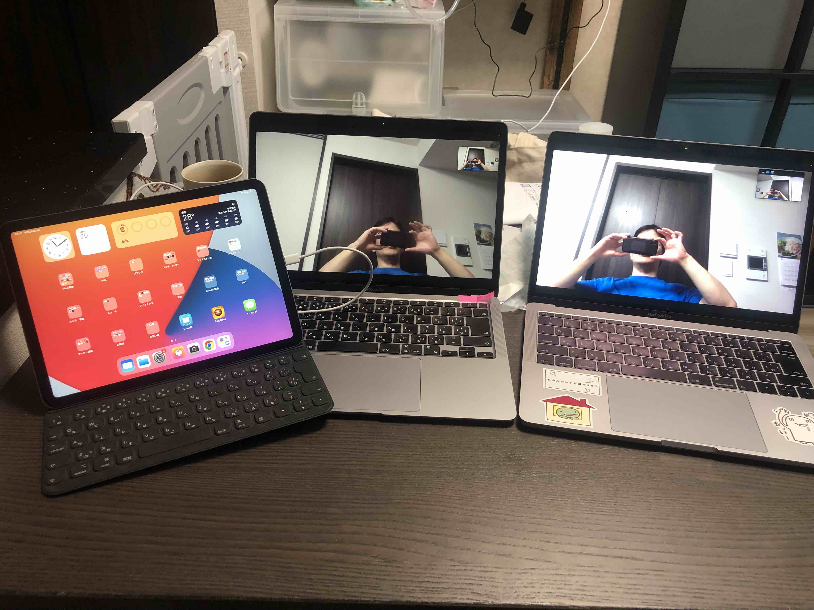
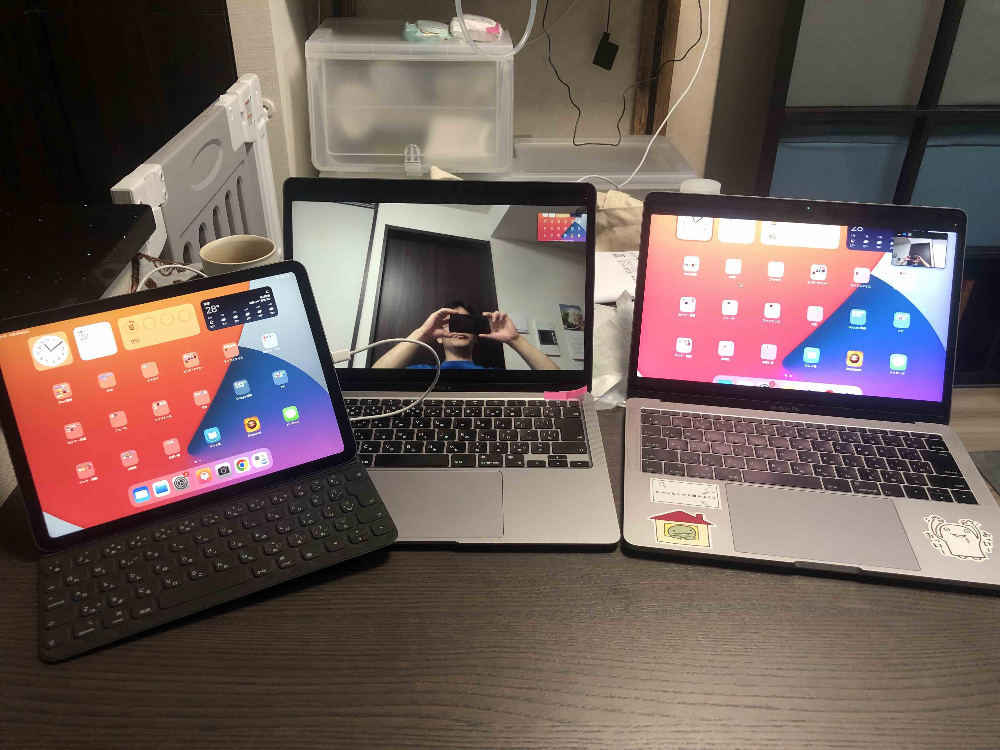

# iOSVirtualCam
このプラグインはMacとiPadを有線接続することで、iPad画面そのものをバーチャルカメラとして扱うことができます。 
プラグインを利用することで、Macの様々なアプリ内でiPadの画面をカメラとして利用することができます。 

作者はMac上でZoom, Teams, WebexなどのWeb会議アプリを動作させた際に、iPad/iPhone画面を通信相手に見せたい場合に活用しています。

## index
+ 使用方法
+ 使用例

## 使用方法
> 工事中

## 使用例

バーチャルカメラ使用前 
 + 左 iPad と 中央 Macbook は有線接続  
 + 中央 Macbook と 右 MacBook はZoomにて通信

 
バーチャルカメラ使用中 

 + 中央 Macbook のZoom上のカメラに iOSVirtualCam を指定
 + 左 iPad ->（有線）-> 中央 Macbook にてiPadの画面が自カメラとして表示されている。（画面左上） 
 + 中央 Macbook -> (Zoom) -> 右 Macbook にてiPadの画面が連携される

バーチャルカメラ使用動画 
 +  左 iPad -> 中央 Macbook -> 右 Macbook の順で画面が同期
